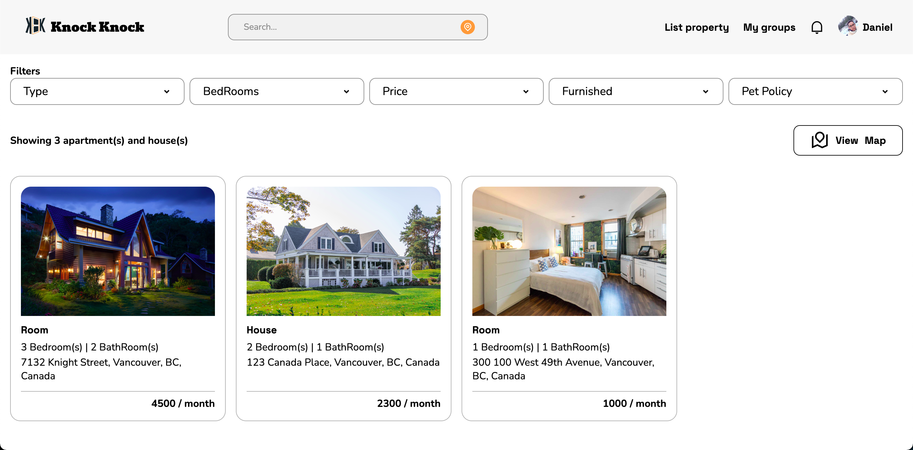

  

  

---

* [Live snapshot](https://frolicking-melomakarona-390640.netlify.app/)

* [Visual Components](https://frolicking-melomakarona-390640.netlify.app/#storybook)

---
# Knock Knock

* Users can create and share places to rent
* Features
  * A user can sign up with email / login / logout
  * A user can filter listings based on:
    * Type
    * Number of Bedrooms
    * Rent Price
    * If the Place is furnished or not
    * Pet policy
  * A user can view listings accordingly to their location
  * A user can view listings in the map
  * A user can view listings details
  * A user can send a message to the listing creator
  * A user can create a new listing
  * A user can create a new group
  * A user can interact with the group members through messages

* Design
  * [Figma](https://figma.com)
  * [Illustrator](https://www.adobe.com/ca/products/illustrator.html)
  * [Photoshop](https://www.adobe.com/ca/products/photoshop.html)
* Management
  * [Notion](https://notion.so)
  * [Slack](https://slack.com)
* Development
  * Backend
    * [Firebase](https://firebase.io)
  * Frontend
    * HTML
    * Javascript
  * Versioning
    * [Github](https://github.com)
  * Text Editor
    * [VSCode](https://code.visualstudio.com/)

---
# Future Features
* Listing Management
  * Listings with groups attached
  * Owners/Tenant Ratings

